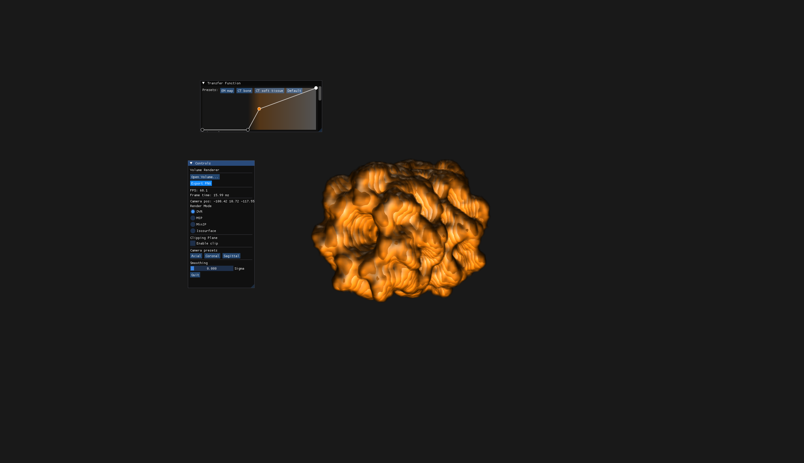
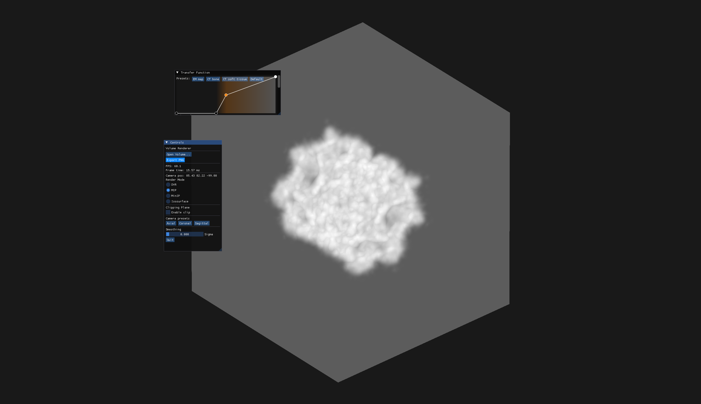
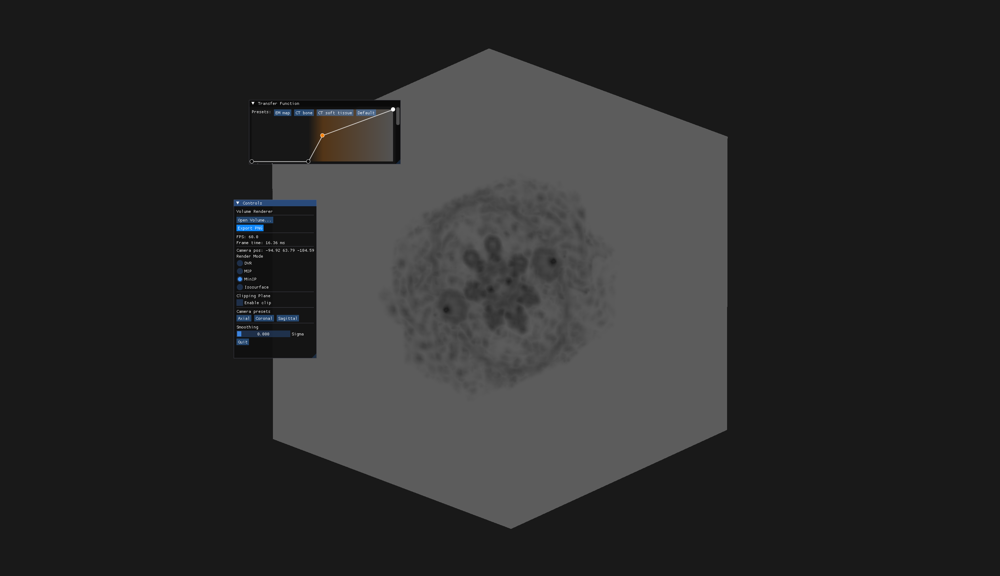
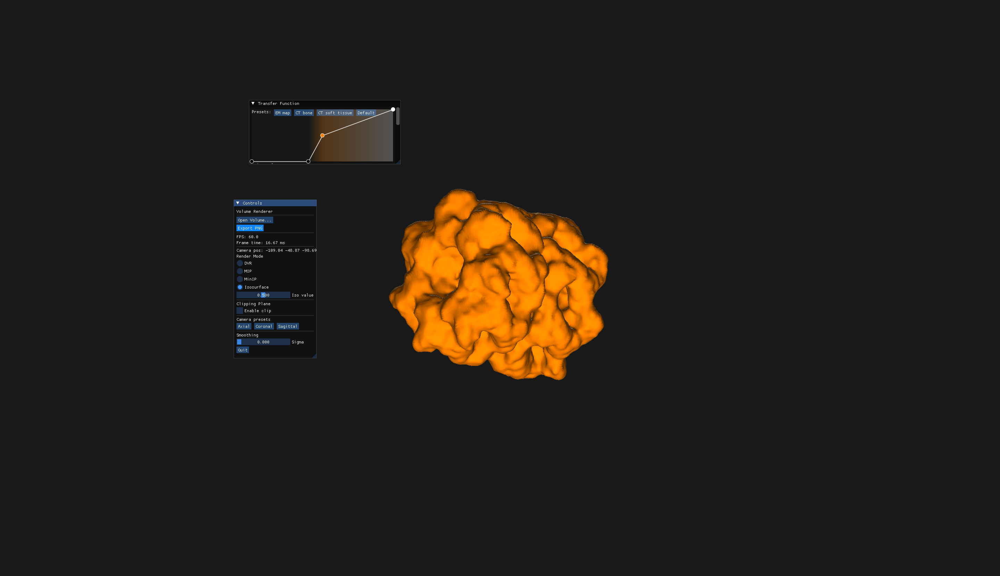
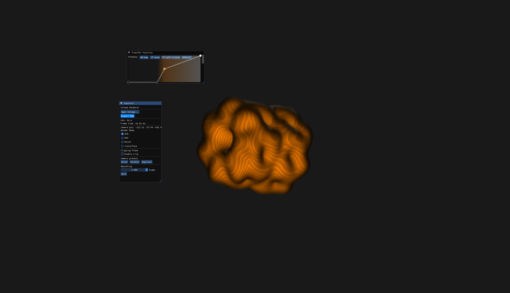
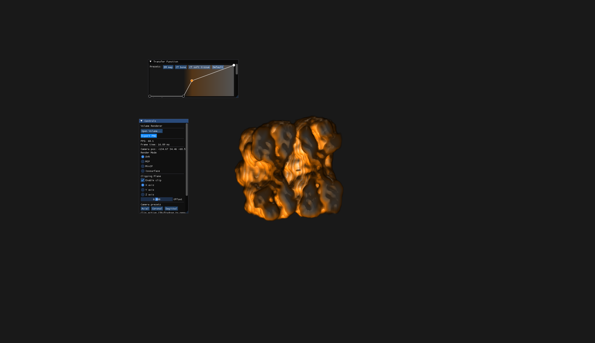

# Volume Renderer

A real-time GPU-accelerated volume renderer built in C++ with OpenGL 4.5. Implements ray marching entirely in GLSL fragment shaders with an interactive transfer function editor, multiple compositing modes, and support for cryo-EM and medical imaging formats.

## Screenshots

## Features

- Real-time ray marching via GLSL fragment shader — one ray per pixel, fully GPU-side
- Interactive transfer function editor with draggable control points, histogram background, and preset configurations
- Four compositing modes: DVR (direct volume rendering with Phong lighting), MIP, MinIP, and hard isosurface
- Gradient-based Phong lighting using central difference approximation of the density gradient
- GPU Gaussian smoothing via separable compute shader (three 1D passes, ping-pong textures)
- Interactive clipping plane — axis-aligned with offset slider, or free placement via Shift+drag
- Anatomical view presets: axial, coronal, sagittal
- Supports MRC/MAP (cryo-EM, EMDB) and NIfTI (CT/MRI, .nii) volume formats

## Algorithms

**Ray marching:** For each screen pixel a ray is generated from camera parameters using the inverse view and projection matrices. The ray is intersected with the volume bounding box using the slab method. The shader then steps along the ray at fixed intervals, sampling the 3D texture and accumulating color and opacity using front-to-back alpha compositing.

**Transfer function:** A 1D texture mapping normalized density values to RGBA color and opacity. The user places control points on an interactive canvas; the texture is baked via piecewise linear interpolation between control points and uploaded to the GPU on every edit.

**Gradient lighting:** At each sample point the density gradient is approximated using central differences — six texture samples in the ±X, ±Y, ±Z directions. The normalized gradient is used as a surface normal for Phong shading with ambient, diffuse, and specular components.

**Separable Gaussian smoothing:** A 3D Gaussian blur is decomposed into three sequential 1D compute shader passes (X, Y, Z). Each pass reads from one 3D texture and writes to another (ping-pong pattern). This reduces complexity from O(r³) to O(3r) samples per voxel.

## Building

### Requirements

- Windows 10 or 11
- Visual Studio 2022 with "Desktop development with C++" workload
- CMake 3.20 or newer
- GPU with OpenGL 4.5 support

### Dependencies

All dependencies are included in `third_party/` or linked as precompiled binaries:

- GLFW 3.4 — window creation and input
- GLAD — OpenGL 4.5 function loader
- GLM — mathematics library
- Dear ImGui (docking branch) — immediate mode UI
- nativefiledialog-extended — OS native file picker
- stb_image_write — PNG export

### Steps

1. Clone the repository: `git clone https://github.com/yourusername/VolumeRenderer.git`
2. Open Visual Studio 2022
3. File → Open → CMake → select the repository root folder
4. Wait for CMake configuration to complete
5. Build → Build All (Ctrl+Shift+B)
6. Run with F5 or the green play button

### Test data

The `data/` folder is excluded from the repository due to file size. Download sample volumes:

- **Cryo-EM (MRC format):** [EMD-1080](https://www.ebi.ac.uk/emdb/EMD-1080) — GroEL chaperonin from EMDB
- **CT/MRI (NIfTI format):** [LIDC-IDRI](https://www.cancerimagingarchive.net/collection/lidc-idri/) from The Cancer Imaging Archive

Place downloaded files in the `data/` folder and open them via the "Open Volume" button in the application.

## Technical notes

- Tested on NVIDIA GeForce RTX 2060 and Intel Iris Xe
- On integrated graphics cards, the compute shader smoothing pass may be slow at high sigma values
- NIfTI support covers uncompressed .nii files; .nii.gz requires manual decompression before loading